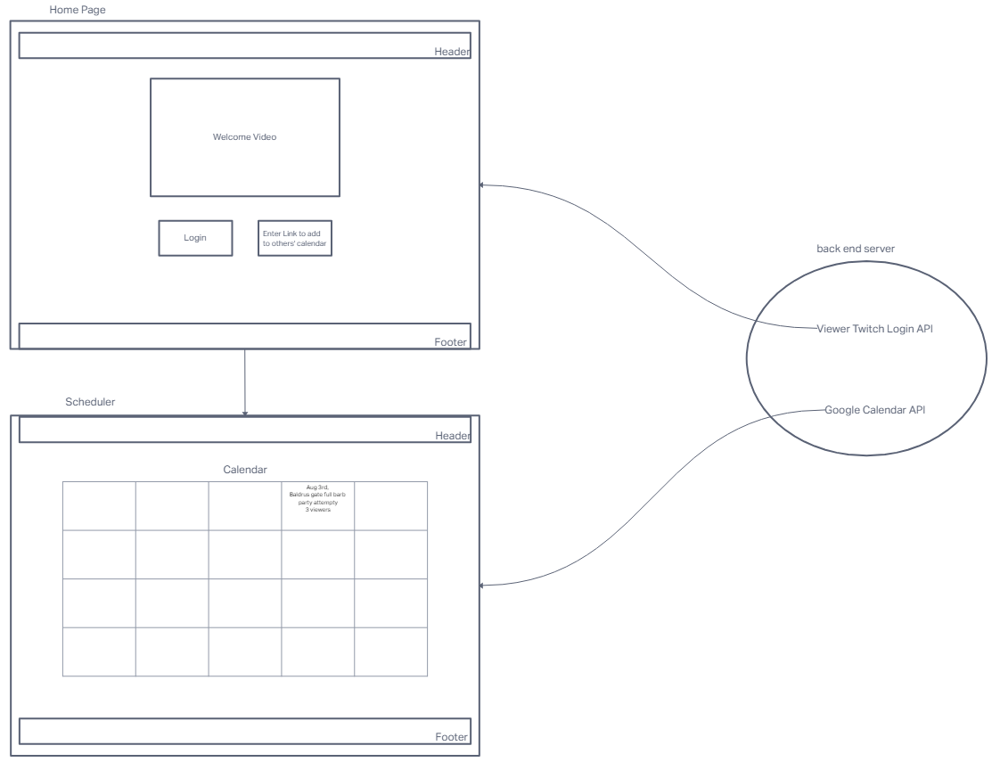

# Gamer Scheduler Application

## Schedule with other gamers easily

### Authors

- [Reece Renninger](https://github.com/reecerenninger)  
- [Ike Steoger](https://github.com/IkeSteoger)

### Problem Domain

The problem we’re solving is the need for an easy to use application that can help gamers schedule gaming sessions easier. This should include an easy way for players to mark their interest and an easy way for everyone to add it to their calendars.

### Links and Resources

- [GitHub Actions ci/cd](https://github.com/reecerenninger/game-scheduler/actions)
<!-- - [back-end dev server url]() -->
<!-- - [back-end prod server url]() -->
<!-- - [front-end dev server url]() -->
- [front-end prod server url](https://gamer-scheduler.netlify.app/)

### Collaborators

- ChatGPT

### How to initialize/run your application

Clone repo, `npm i`, then `npm start`.

<!-- ### Tests

To run tests, after running `npm i`, run the command `npm test`. -->

<!-- ### Routes -->

### Resources

- [Favicon Image](https://icons8.com/icons/set/favicon-arcade)

### UML

